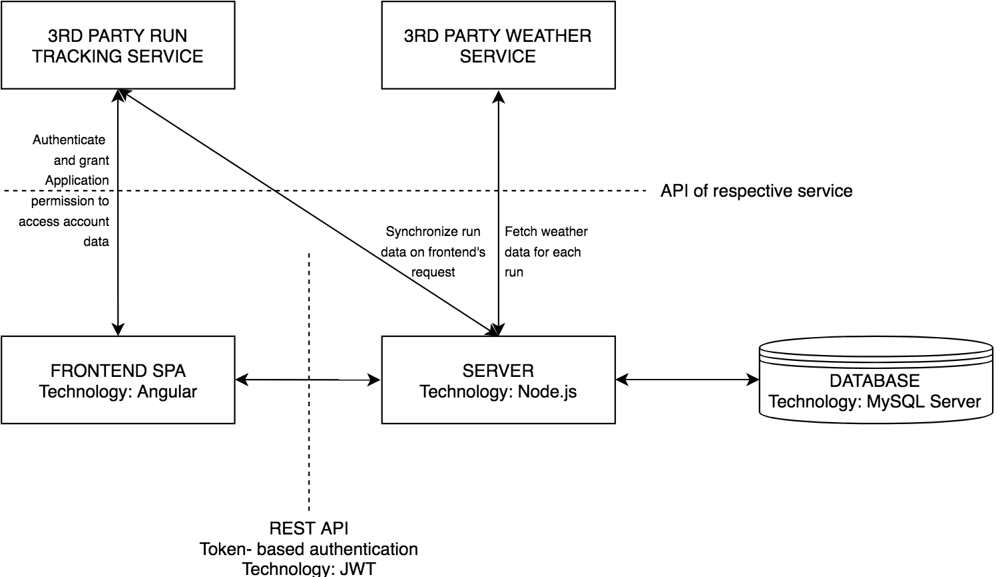

# Compete Running

## General Description
Compete Running is my senior project - I graduate May 11 2019 and currently looking for a permanent job. Compete Running is a web application built to use trademarked running performance scoring system of the same name. Webapp synchronizes users' run metrics from tracking service API and combines them with weather service API data on temperature, dew point and wind speed at time and location of the run. This data is used to calculate intermediate scores based on each metric and a total score. All of the parameters are then visualized for a user in an interactive chart providing reach opportunities for exploration. 

### Beta-testing and reliability
Currently Compete Running is being tested by 6 users who combined have over 4 thousand runs. Competer Running website is built to forsee all the edge cases and is being perfected based on test users' feedback.

### Technology used
Core: Node.js, Express, Angular, MySQL
Testing: Jest, SuperTest
Vizualizations: Chart.js
Deployment: AWS S3, ElasticBeanstalk, RDS
APIs: Strava, Darksky

Here is a high-level diagram of application logic

## Use cases
### Strava and DarkSky sync:
When users first log into their account they are redirected to Strava to grant Compete Running permission to access their running data. Once they grant the permission the server uses Strava-issued authorization token to pull users' run history, get weather data for each individual run and store everything in the database. On subsequent visits Compete Running automatically insures that new runs since last visit are processed accordingly.

### Exploring the chart:
* When runs are presented to the users they have multiple ways of exploring them. All of the data points on the chart are clickable and details about corresponding runs are displayed on the sidebar. For consistent calculations run data is stored in metric units in the database but is converted and displayed in imperial units on frontend.

* The visualization features date picker allowing users to specify a window for which runs should be displayed. Additionally, users have option of specifying which run metrics they want to be plotted to see how they affect each other.

